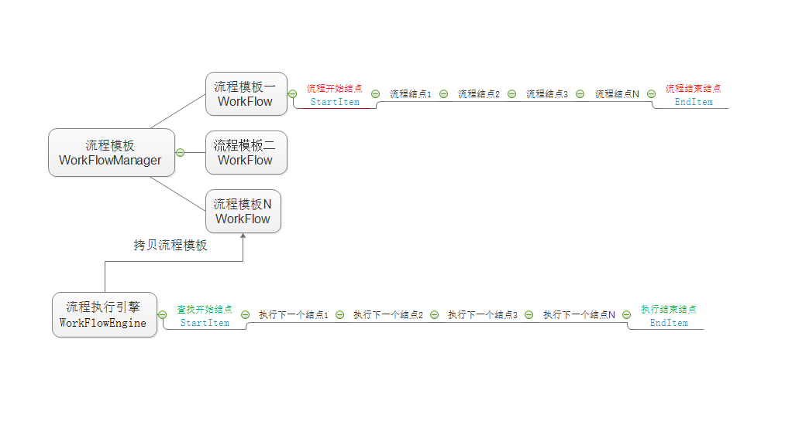

# 最小的流程引擎核心模块

流程引擎核心结构

<H2>GoCsp最小任务系统模块</H2>

最小任务系统特点：

- 1.GoCsp模块是基于CsGo项目的整合优化开发。

- 2.基于CSP模型构建，主要用于工控逻辑、运动控制开发。

- 3.相对于传统多线程模型、状态机模型、类PLC模型，逻辑结构紧凑清晰，开发效率极高，易于维护升级；在golang语言的编程模式上设计开发，且进行必要的功能扩展。

- 4.自定义单/多线程调度，亦可主UI线程调度，方便逻辑与UI的交互。

- 5.自带高精度定时器、调度优先级、逻辑停止、逻辑暂停功能。

- 6.树形多任务调度，提高逻辑的可靠性。

- 7.单线程调度每秒100万次以上，从容应对千级IO点数。

**在模块内部的Test文件上有示例代码**